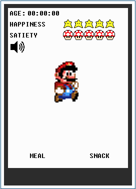
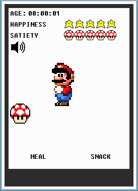
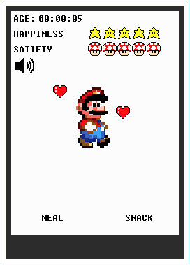
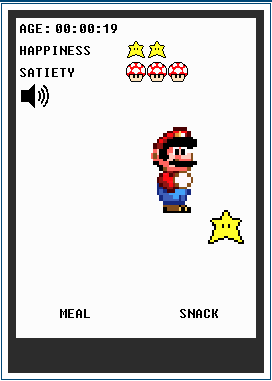
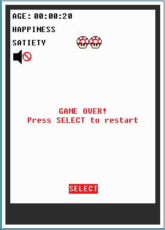

# Landtiger LPC1768 - game inspired by Tamagotchi
This project was assigned as extra points project for the course Architetture dei sistemi di elaborazione (02GOLOV) at Politecnico di Torino.

The aim of the project was the implementation of a game similar to the popular Tamagotchi on a embedded platform. For this particular course, we used a LandTiger board, based on NXP LPC1768 microcontroller.

<p align="center">
  
</p>

## Description
The aim of the game is to take care of the character. If not feeded, or cuddled, it will go away from the screen and the game is over. On top of the screen there is an age counter, this will show the game time in hours, minutes, seconds. Below the age counter, HAPPINESS and SATIETY status bars are shown. These two bars consist in a scale from 0 to 5. If one of these bars go to 0, game over animation is forced. Every 5 seconds from the last related action, if no action is taken, the bars will decrease their value. 

  <div align="center">
       &nbsp &nbsp
       &nbsp &nbsp
       &nbsp &nbsp
       &nbsp &nbsp
  </div>


This (final) version of the game uses the joystick and TouchPanel as input. The joystick left/right keys allow to make a choice between meal or snack (highlighted in red). The joystick select key starts the highlighted action. By touching the character on the TouchPanel, a cuddle animation is forced.
After the action is completed, if the related bar value is below 5, it will increase its value.

Sounds for each animation (start, eating, cuddle) are added, and volume can be adjusted by using the integrated potentiometer. 

## Note (READ!)
To use this project, you have to install Keil μVision v5 (any version should be fine) along with ARM compiler version 5 (MANDATORY!!), and open the ``` sample.uvprojx ``` file. This was fully developed on Keil, with C libraries for the board. ASM was used only to increase stack and heap size.

You can clone the repository with the following command:

``` git clone https://github.com/therossee/tamagotchi-landtiger.git ```


## Further notes
I have added the complete specifications in ``` extra_point ``` folder, an application note (in Italian) about the implementation of the sounds in the game. 
In the main folder you will also find a video with the game in action on the actual board. 

Have fun! :)
